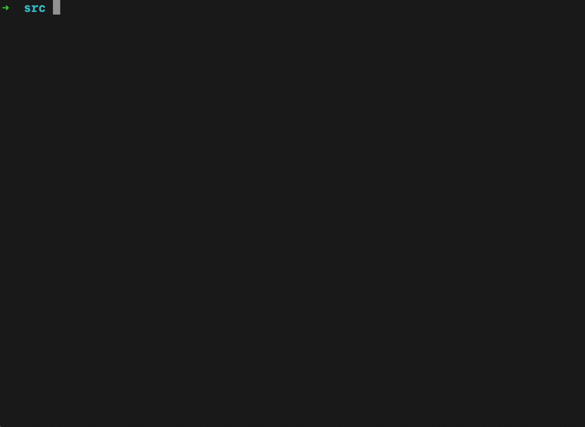

# Reverse-Polish-Notation

## Description

### Conditions

* The size of the field for displaying graphs is a rectangle of 25 by 80 points.

* Definition area - [0; 4 Pi]

* Range of values - [-1; 1]

* Orientation of the coordinate plane - the ordinate axis is directed downward, the abscissa axis is directed to the right.

* The center of coordinates is middle of the left border (point {0, 13}).

* Values are rounded according to the rules of mathematics.

### Graphics
  
* The field is displayed using Star symbol for the chart line and "." for the rest of the screen space.

## Important notes

* The game is written in C, has a structured style, and is run from the terminal
  
* The source code has been tested by the static analyzer `cppcheck`, as well as the style linter `cpplint`

* In developing the game, the principles of structured programming by E. Dijkstra were followed
